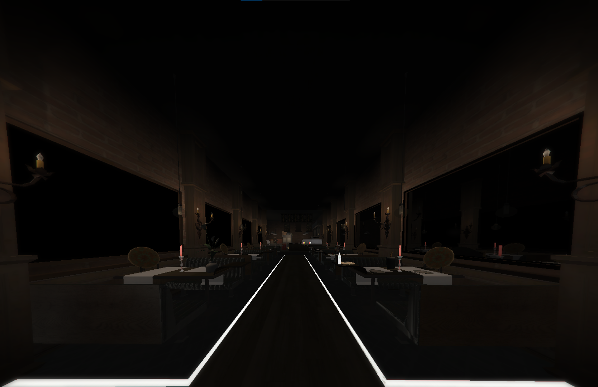
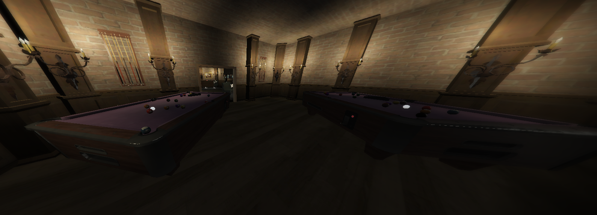

# Central Restaurant YMAP MLO for FiveM

## Description

This YMAP MLO (Map Editor) file adds a central restaurant to your FiveM server. The restaurant is designed to provide an immersive dining experience for players in your server. It features carefully placed objects, interiors, and lighting to create a realistic and engaging environment.

## Features

- **Central Location**: The restaurant is strategically placed in a central area, making it easily accessible for players from various parts of the city.

- **Interior Detailing**: The interior is meticulously designed with attention to detail, providing a realistic atmosphere for players to enjoy.

- **Seating and Dining Areas**: The restaurant features a variety of seating options, including booths, tables, and barstools, to cater to different player preferences.

- **Kitchen Area**: A well-furnished kitchen area is included, giving players a sense of realism and immersion as they explore the restaurant.

- **Functional Elements**: Certain elements within the restaurant, such as doors, lights, and interactive objects, are fully functional to enhance the gameplay experience.

## Installation

1. Make sure you have the latest version of [FiveM](https://fivem.net/) installed.

2. Download this repository.

3. Place the downloaded resource in the `resources` directory of your FiveM server.

4. Add the following line to your server's `server.cfg` file:

5. Restart your FiveM server.

6. Enjoy the new central restaurant in your server!

## Screenshots

